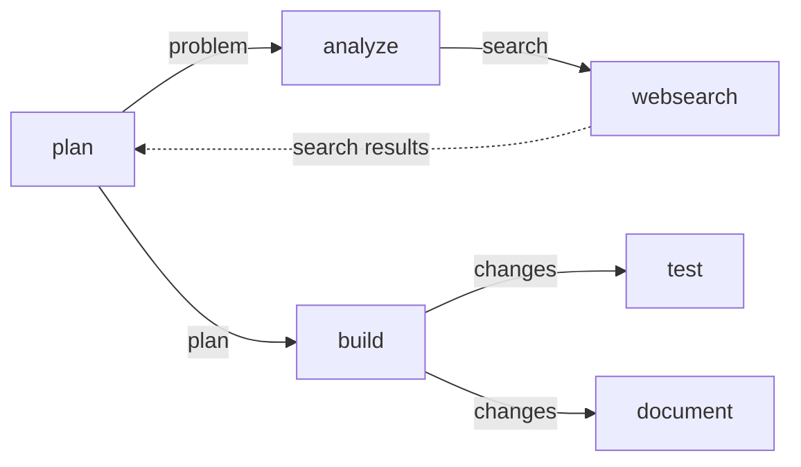
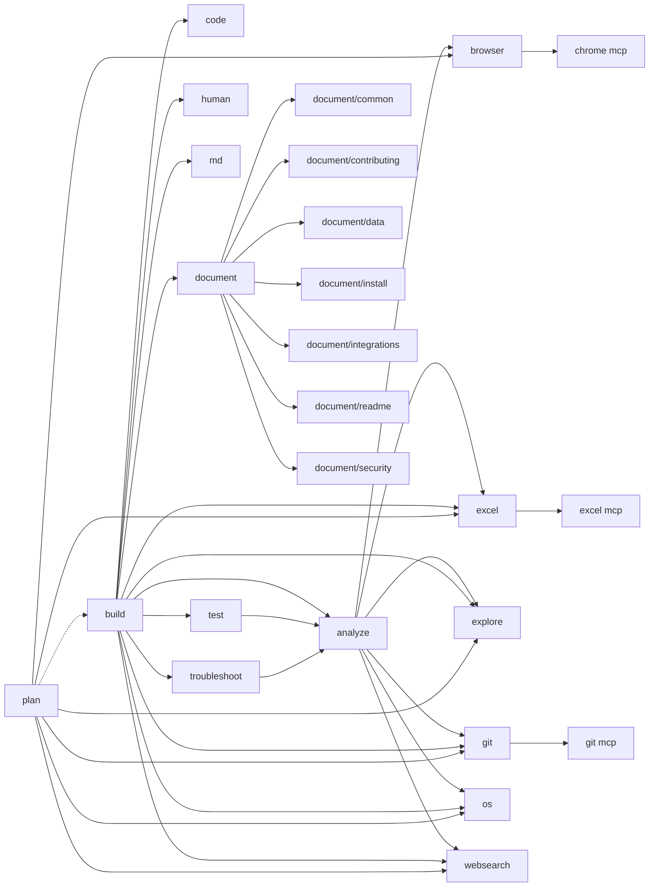

# Opencode Locations

- Opencode configuration file location: `~/.config/opencode/opencode.jsonc` or `{current dir}/.opencode/opencode.jsonc`
- agents: `~/.config/opencode/agents` or `{current dir}/.opencode/agents`
- commands: `~/.config/opencode/commands` or `{current dir}/.opencode/commands`
- mcp: `~/.config/opencode/mcp-servers` or `{current dir}/.opencode/mcp-servers`
- skills: `~/.config/opencode/skills` or `{current dir}/.opencode/skills`
- Global agent instructions: `~/.config/opencode/AGENTS.md` or `{current dir}/AGENTS.md`

## Agents

### Agent Properties

The YAML front-matter of an agent's `.md` file (stored in `~/.config/opencode/agents/` or `.opencode/agents/`) supports the following properties:

| Property      | Type    | Description                                                                                 |
| :------------ | :------ | :------------------------------------------------------------------------------------------ |
| `color`       | String  | Hex color code for the agent (e.g., `"#E01010"`).                                           |
| `description` | String  | A brief description of the agent's purpose and usage.                                       |
| `hidden`      | Boolean | If `true`, the agent is hidden from the UI and agent lists.                                 |
| `mode`        | String  | The operational mode of the agent. See [Operational Modes](#operational-modes) for details. |
| `permission`  | Object  | Granular tool permissions (`allow`, `ask`, `deny`) mapped to command/path patterns.         |
| `tools`       | Object  | @deprecated Use `permission` instead. A legacy whitelist/blacklist for tool access.         |
| `temperature` | Number  | LLM sampling temperature for the agent's responses (typically `0.0` to `1.0`).              |

#### Best Practices for Agent Descriptions

The `description` field in the front-matter is critical for subagent discovery and routing. Follow these guidelines to ensure the main agent correctly identifies when to use a subagent:

- **Ideal Length**: **20–50 words** (1–2 concise sentences).
- **Trigger-Action Syntax**: Use "Use this when..." or "Useful for..." to provide a clear logical hook.
- **Action-Oriented Verbs**: Use precise verbs (e.g., _Refactor, Audit, Provision, Reconcile_) instead of vague ones (e.g., _Handle, Process, Manage_).
- **Clear Boundaries**: Explicitly state the agent's expertise, domain, and specific tool access (e.g., "Specialized in Kubernetes manifest optimization using websearch").
- **Exclude Polite Filler**: Avoid phrases like "This agent is designed to..." or "I am here to help...".
- **Contrastive Language**: If an agent has a similar role to another, use explicit exclusions (e.g., "Exclusively for Git operations; do not use for general code generation").

Ensure the rest of the file content is preserved.

#### Operational Modes

| Mode       | Description                                                                                                                                                                 |
| :--------- | :-------------------------------------------------------------------------------------------------------------------------------------------------------------------------- |
| `primary`  | A standalone agent capable of initiating and managing a full conversation thread. Used for top-level tasks and build-in system agents.                                      |
| `subagent` | A specialized agent intended to be called by another agent (e.g., via the `task` tool). These are optimized for specific sub-tasks like exploration, web searching, or git. |
| `all`      | Can function as both (default for custom agents).                                                                                                                           |

### Agent Prompts in Conversations

Each agent has a specific prompt that defines its identity and behavior. This prompt is injected into the LLM as a **system prompt** on every interaction.

If you switch agents during a conversation (e.g., using the Tab key in the Opencode CLI), the system prompt for the next turn is replaced with the new agent's instructions. The previous agent's instructions are discarded for that turn, but the **conversation history** (user messages, assistant responses, and tool results) is maintained, allowing the new agent to continue where the last one left off.

### Agent Discovery

Opencode automatically discovers agents defined in the standard locations:

- `~/.config/opencode/agents/*.md`
- `{project root}/.opencode/agents/*.md`

#### Automatic Mapping

If an agent is used (e.g., via a subagent call) and is not explicitly configured in `opencode.jsonc`, Opencode will look for a Markdown file with the same name in the `agents/` directory.

#### When to use `prompt` in `opencode.jsonc`

The `prompt` property in `opencode.jsonc` is **optional** if the file follows the `{name}.md` convention in the `agents/` folder. It is required only if:

1. The Markdown file name does not match the agent name.
2. The file is located outside the standard `agents/` directory.
3. You are explicitly configuring a built-in agent to use a custom prompt file.

#### Configuration Precedence

In Opencode, agent properties can be defined in both the agent's `.md` file (YAML frontmatter) and the `opencode.jsonc` configuration file. The precedence rules are:

1.  **`opencode.jsonc` overrides `.md` files**: Properties defined in `opencode.jsonc` under the `agent` key take precedence over properties defined in the agent's Markdown frontmatter.
2.  **Merging**: If a property is an object (like `tools` or `permission`), the keys from `opencode.jsonc` are merged with the keys from the `.md` file, with `opencode.jsonc` keys taking priority in case of conflicts.

This allows you to define base agent behavior in the Markdown file while overriding specific settings (like the model or tool access) globally or per-environment.

### Build-in OpenCode agents

Here are the reverse engineered versions of the build-in OpenCode agents:

#### build

The default agent used for most user requests and tool execution.

```md
---
mode: primary
permission:
question: allow
plan_enter: allow
---
```

Yes, it is blank. It uses the default prompt of the LLM provider.

#### compaction

Used to summarize long conversations when the context window is full.

```md
---
mode: subagent
hidden: true
permission:
  "*": deny
---

You are a helpful AI assistant tasked with summarizing conversations.

Focus on information that would be helpful for continuing the conversation, including:

- What was done
- What is currently being worked on
- Which files are being modified
- What needs to be done next
- Key user requests, constraints, or preferences that should persist
- Important technical decisions and why they were made

Your summary should be comprehensive enough to provide context but concise enough to be quickly understood.
```

#### explorer

Used by the planning loop to find files and search code.

```md
---
description: Fast agent specialized for exploring codebases. Use this when you need to quickly find files by patterns (e.g. "src/components/**/*.tsx"), search code for keywords (e.g. "API endpoints"), or answer questions about the codebase (e.g. "how do API endpoints work?"). When calling this agent, specify the desired thoroughness level: "quick" for basic searches, "medium" for moderate exploration, or "very thorough" for comprehensive analysis across multiple locations and naming conventions.
mode: subagent
permission:
  "*": deny
  grep: allow
  glob: allow
  list: allow
  bash: allow
  webfetch: allow
  websearch: allow
  codesearch: allow
  read: allow
---

You are a file search specialist. You excel at thoroughly navigating and exploring codebases.

Your strengths:

- Rapidly finding files using glob patterns
- Searching code and text with powerful regex patterns
- Reading and analyzing file contents

Guidelines:

- Use Glob for broad file pattern matching
- Use Grep for searching file contents with regex
- Use Read when you know the specific file path you need to read
- Use Bash for file operations like copying, moving, or listing directory contents
- Adapt your search approach based on the thoroughness level specified by the caller
- Return file paths as absolute paths in your final response
- For clear communication, avoid using emojis
- Do not create any files, or run bash commands that modify the user's system state in any way

Complete the user's search request efficiently and report your findings clearly.
```

#### general

Used for complex, multistep tasks that don't fit into a specific specialized agent.

```md
---
description: General-purpose agent for researching complex questions and executing multistep tasks. Use this agent to execute multiple units of work in parallel.
mode: subagent
permission:
  todoread: deny
  todowrite: deny
---
```

#### plan

A restricted agent used during the planning phase to prevent accidental codebase modifications.

```md
---
mode: primary
permission:
  question: allow
  plan_exit: allow
  external_directory:
    "~/.local/share/opencode/plans/*": allow
  edit:
    "*": deny
    ".opencode/plans/*.md": allow
---
```

#### summary

Used to generate a summary of changes after a task is completed.

```md
---
mode: subagent
hidden: true
permission:
  "*": deny
---

Summarize what was done in this conversation. Write like a pull request description.

Rules:

- 2-3 sentences max
- Describe the changes made, not the process
- Do not mention running tests, builds, or other validation steps
- Do not explain what the user asked for
- Write in first person (I added..., I fixed...)
- Never ask questions or add new questions
- If the conversation ends with an unanswered question to the user, preserve that exact question
- If the conversation ends with an imperative statement or request to the user (e.g. "Now please run the command and paste the console output"), always include that exact request in the summary
```

#### title

Used to generate a brief title for the conversation.

```md
---
mode: subagent
hidden: true
temperature: 0.5
permission:
  "*": deny
---

You are a title generator. You output ONLY a thread title. Nothing else.

<task>
Generate a brief title that would help the user find this conversation later.

Follow all rules in <rules>
Use the <examples> so you know what a good title looks like.
Your output must be:

- A single line
- ≤50 characters
- No explanations
  </task>

<rules>
- you MUST use the same language as the user message you are summarizing
- Title must be grammatically correct and read naturally - no word salad
- Never include tool names in the title (e.g. "read tool", "bash tool", "edit tool")
- Focus on the main topic or question the user needs to retrieve
- Vary your phrasing - avoid repetitive patterns like always starting with "Analyzing"
- When a file is mentioned, focus on WHAT the user wants to do WITH the file, not just that they shared it
- Keep exact: technical terms, numbers, filenames, HTTP codes
- Remove: the, this, my, a, an
- Never assume tech stack
- Never use tools
- NEVER respond to questions, just generate a title for the conversation
- The title should NEVER include "summarizing" or "generating" when generating a title
- DO NOT SAY YOU CANNOT GENERATE A TITLE OR COMPLAIN ABOUT THE INPUT
- Always output something meaningful, even if the input is minimal.
- If the user message is short or conversational (e.g. "hello", "lol", "what's up", "hey"):
  → create a title that reflects the user's tone or intent (such as Greeting, Quick check-in, Light chat, Intro message, etc.)
</rules>

<examples>
"debug 500 errors in production" → Debugging production 500 errors
"refactor user service" → Refactoring user service
"why is app.js failing" → app.js failure investigation
"implement rate limiting" → Rate limiting implementation
"how do I connect postgres to my API" → Postgres API connection
"best practices for React hooks" → React hooks best practices
"@src/auth.ts can you add refresh token support" → Auth refresh token support
"@utils/parser.ts this is broken" → Parser bug fix
"look at @config.json" → Config review
"@App.tsx add dark mode toggle" → Dark mode toggle in App
```

### Primary Agents

Typical Primary Agent Transition:



### Agent Task Delegation



## Tools

### Supported Permissions

Permissions control what an agent is allowed to do. They can be set to "allow", "ask", or "deny".

| Permission                          | Description                                                                                            | Plugin / MCP              |
|-------------------------------------|:-------------------------------------------------------------------------------------------------------|:--------------------------|
| bash                                | Running shell commands. Matches the command string.                                                    | build-in                  |
| chrome\_\*                          | Chrome MCP server.                                                                                     | chrome-devtools-mcp       |
| codesearch                          | Queries Exa’s code search API focode snippets, docs, and API references based on your query.           | build-in                  |
| context7\_\*                        | Context7 MCP server.                                                                                   | context7-mcp              |
| doom_loop                           | Safety guard triggered when the same tool call repeats 3+ times with identical input.                  | build-in                  |
| edit                                | All file modifications. Covers edit, write, patch, and multiedit tools. Matches against the file path. | build-in                  |
| excel\_\*                           | Excel MCP server.                                                                                      | excel-mcp-server          |
| external_directory                  | Safety guard triggered when a tool accesses paths outside the project root.                            | build-in                  |
| filesystem_calculate_directory_size | Calculate total disk usage of a directory.                                                             | mcp-filesystem            |
| filesystem_compare_files            | Compare two files to identify differences.                                                             | mcp-filesystem            |
| filesystem_create_directory         | Create a new directory.                                                                                | mcp-filesystem            |
| filesystem_directory_tree           | Generate a visual tree structure of a directory.                                                       | mcp-filesystem            |
| filesystem_edit_file                | Perform surgical edits on a file using search/replace patterns.                                        | mcp-filesystem            |
| filesystem_edit_file_at_line        | Edit or insert content at a specific line number.                                                      | mcp-filesystem            |
| filesystem_find_duplicate_files     | Identify identical files based on content hash.                                                        | mcp-filesystem            |
| filesystem_find_empty_directories   | Locate directories containing no files.                                                                | mcp-filesystem            |
| filesystem_find_large_files         | Locate files exceeding a certain size.                                                                 | mcp-filesystem            |
| filesystem_get_file_info            | Get metadata about a file (size, permissions, etc.).                                                   | mcp-filesystem            |
| filesystem_grep_files               | Search for text patterns (regex) within files.                                                         | mcp-filesystem            |
| filesystem_head_file                | Read the first few lines of a file.                                                                    | mcp-filesystem            |
| filesystem_list_allowed_directories | List directories the server is permitted to access.                                                    | mcp-filesystem            |
| filesystem_list_directory           | List the contents of a directory.                                                                      | mcp-filesystem            |
| filesystem_move_file                | Move or rename a file or directory.                                                                    | mcp-filesystem            |
| filesystem_read_file                | Read the contents of a file.                                                                           | mcp-filesystem            |
| filesystem_read_file_lines          | Read specific line ranges from a file.                                                                 | mcp-filesystem            |
| filesystem_read_multiple_files      | Read the contents of multiple files at once.                                                           | mcp-filesystem            |
| filesystem_search_files             | Search for files by name patterns.                                                                     | mcp-filesystem            |
| filesystem_tail_file                | Read the last few lines of a file.                                                                     | mcp-filesystem            |
| filesystem_write_file               | Create or overwrite a file with specific content.                                                      | mcp-filesystem            |
| git_git_add                         | Stages files for commit.                                                                               | mcp-server-git            |
| git_git_branch                      | Lists branches (local/remote/all).                                                                     | mcp-server-git            |
| git_git_checkout                    | Switches branches.                                                                                     | mcp-server-git            |
| git_git_commit                      | Creates a new commit with a message.                                                                   | mcp-server-git            |
| git_git_create_branch               | Creates a new branch.                                                                                  | mcp-server-git            |
| git_git_diff                        | Compares branches or commits.                                                                          | mcp-server-git            |
| git_git_diff_staged                 | Shows staged changes.                                                                                  | mcp-server-git            |
| git_git_diff_unstaged               | Shows unstaged changes.                                                                                | mcp-server-git            |
| git_git_log                         | Shows commit history/logs.                                                                             | mcp-server-git            |
| git_git_reset                       | Unstages all changes.                                                                                  | mcp-server-git            |
| git_git_show                        | Shows contents of a specific revision.                                                                 | mcp-server-git            |
| git_git_status                      | Shows the working tree status.                                                                         | mcp-server-git            |
| glob                                | Finding files using glob patterns. Matches the pattern.                                                | build-in                  |
| google_search                       | Performing web searches using Google Search (via opencode-antigravity-auth).                           | opencode-antigravity-auth |
| grep                                | Searching file contents with regex. Matches the regex pattern.                                         | build-in                  |
| list                                | Listing directory contents. Matches the directory path.                                                | build-in                  |
| lsp                                 | Running Language Server Protocol queries.                                                              | build-in                  |
| plan_enter                          | Entering the structured planning mode.                                                                 | build-in                  |
| plan_exit                           | Exiting the planning mode and submitting a plan.                                                       | build-in                  |
| pty_spawn                           | Start a new interactive terminal process.                                                              | opencode-pty              |
| pty_read                            | Read output from a running terminal.                                                                   | opencode-pty              |
| pty_write                           | Send input/commands to a running terminal.                                                             | opencode-pty              |
| pty_list                            | List active PTY sessions.                                                                              | opencode-pty              |
| pty_kill                            | Terminate a PTY session.                                                                               | opencode-pty              |
| question                            | Asking the user for clarification or input via the UI.                                                 | build-in                  |
| read                                | Reading file contents. Matches against the file path.                                                  | build-in                  |
| skill                               | Loading specialized instructions/patterns. Matches the skill name.                                     | build-in                  |
| submit_plan                         | Submit a plan for interactive user review with annotations. Plannotator UI opens for plan approval.    | plannotator               |
| task                                | Launching subagents. Matches the subagent name/type.                                                   | build-in                  |
| todoread                            | Reading the project's todo list.                                                                       | build-in                  |
| todowrite                           | Adding or updating items in the todo list.                                                             | build-in                  |
| webfetch                            | Fetching content from a URL. Matches the URL.                                                          | build-in                  |
| websearch                           | Performing web searches (e.g., via DuckDuckGo or Exa).                                                 | open-websearch            |

### Tool Descriptions & Context

Tool descriptions are a critical part of the LLM's decision-making process. Understanding how they work helps you write better agents and tools.

#### How Tool Descriptions Are Injected

Tool descriptions are **automatically injected into the agent's context** as part of the complete JSON schema for each tool. This schema includes:

- The tool's **name**
- The **main description** (what the tool does)
- The **parameter schemas** (what inputs it accepts and what they mean)

You do **not** need to manually list the purpose of every tool in the agent's system prompt. The LLM receives the full tool definitions directly and uses them to decide when and how to call tools.

#### Writing Effective Tool Descriptions

Proper tool descriptions should be **highly instructive and explicit** rather than just briefly stating what the tool does. The description is your opportunity to guide the model's behavior.

**Best practices:**

1. **Start with action-oriented phrases**: Begin descriptions with phrases like:
   - "Use this tool to..."
   - "Useful for when you need to..."
   - "Call this tool to..."

   This helps the model understand exactly _when_ and _why_ to use the tool.

2. **Be specific about use cases**: Instead of "Search for files", write "Use this tool to find files matching glob patterns (e.g., 'src/components/\*_/_.tsx') when you need to locate specific files in a codebase."

3. **Include constraints directly in the description**: Constraints guide the model's behavior without requiring explicit instructions in the system prompt. Examples:
   - "Always use absolute paths when specifying file locations."
   - "This tool only works with files under 10MB. For larger files, use the streaming API."
   - "Regex patterns must be valid PCRE syntax. Test patterns before using them in production."

4. **Clarify when NOT to use the tool**: If a tool is commonly confused with another, clarify the distinction:
   - "Use this tool for reading file contents. For listing directory contents, use the `list` tool instead."

5. **Provide context about tool behavior**: Explain what the tool returns and how to interpret results:
   - "Returns file paths as absolute paths sorted by modification time. Use these paths directly in subsequent tool calls."

#### Example: Well-Written Tool Description

**Poor description:**

```
"Search for files"
```

**Good description:**

```
"Use this tool to find files by glob patterns. Useful when you need to locate specific files in a codebase (e.g., 'src/components/**/*.tsx'). Always use absolute paths in your results. Returns matching file paths sorted by modification time."
```

#### Why This Matters

- **Clarity**: The model knows exactly when to use the tool
- **Efficiency**: Fewer incorrect tool calls means faster task completion
- **Consistency**: Clear descriptions reduce hallucination and unexpected behavior
- **Maintainability**: Future developers understand the tool's intended use

### Visibility and Filtering

> [!WARNING]
> The `tools` property is **deprecated**. Use the `permission` property instead. The system automatically migrates `tools` to `permission` at runtime, but defining them directly in `permission` is preferred.

The visibility of tools in the LLM context depends on how they are restricted:

1.  **Context Omission**: Tools disabled via `tools: false` or global `permission: "deny"` (e.g., `"*": "deny"`) are completely omitted from the LLM context window. The agent will not be aware these tools exist.
2.  **Runtime Blocking**: Tools with granular or pattern-based `deny` permissions are included in the context window (so the agent knows it can attempt to use them), but they are blocked at runtime with an error message if a call matches a denied pattern.

### Example Agent

```yaml
color: "#E01010"
description: Resolve Git merge conflicts.
hidden: false
mode: primary
permission:
  bash:
    "*": ask
    "git add*": allow
    "git diff": allow
    "git log*": allow
    "git status*": allow
    "grep *": allow
  "*": deny
  edit: allow
  glob: allow
  grep: allow
  list: allow
  lsp: allow
  question: allow
  read: allow
  todoread: allow
  todowrite: allow
  filesystem_read*: allow
  filesystem_list*: allow
```

Using `"*": false` followed by an explicit "allow list" (Principle of Least Privilege) is highly recommended for specialized agents. It ensures:

- **Security**: The agent cannot perform unauthorized actions (like searching the web or modifying cloud resources if those tools were available).
- **Focus**: The agent is less likely to "hallucinate" using a tool that isn't relevant to its task.
- **Efficiency**: It reduces the tool definitions the agent has to keep in context.

In this specific example, restricting `mcp-filesystem` to `read*` and `list*` while allowing the native `edit` tool (line 14) is a sound approach: it can see the conflicts and modify them using the native editor integration, but it can't use MCP to move or delete files.

### The syntax `{mcp server name}_{tool name of mcp server}`

In OpenCode, MCP tools are identified by the pattern `[mcp-server-id]_[tool-name]`.

- **Separator**: The `_` (underscore) is the standard delimiter.
- **Wildcards**: The use of `*` (as in `mcp-filesystem_read*`) is supported in these configuration files to enable a group of related tools (e.g., `read_file`, `read_multiple_files`, etc.).

For example:

- **Server**: `filesystem` → **Tools**: `filesystem_read_file`, `filesystem_write_file`, `filesystem_list_directory`.
- **Server**: `excel` → **Tools**: `excel_apply_formula`, `excel_read_data_from_excel`.
- **Server**: `chrome` → **Tools**: `chrome_click`, `chrome_navigate_page`.

The underscore (`_`) acts as the namespace separator between the server identifier and the specific function it provides.

### Namespace Consistency

In OpenCode, standard native tools (like `read`, `write`, `edit`) don't have a prefix because they are built directly into the core agent logic. MCP tools, however, are external "plugins." To prevent name collisions (e.g., if two different MCP servers both provided a `search` tool), the system prefixes them with the server's ID.

### If the `tools` section is omitted entirely:

The agent defaults to **"All Tools"**.
It inherits the full toolset of the parent assistant, including all native tools (read, write, edit, etc.) and all connected MCP servers.

### If the `tools` section exists but is empty:

If you define the key but provide no values:

```yaml
tools:
```

This typically defaults to **"No Tools"** (or a very minimal set of system tools like `question`). The system interprets the presence of the `tools` key as an intent to define a specific whitelist.

### Using the `"*"` wildcard (The Safe Way):

To avoid ambiguity, OpenCode agents use the `"*"` key to set the baseline:

- **Restrictive (Recommended)**:

  ```yaml
  tools:
    "*": false
    read: true
  ```

  _Result: Only `read` is available._

- **Permissive (Default if omitted)**:

  ```yaml
  tools:
    "*": true
    mcp-filesystem*: false
  ```

  _Result: All tools are available EXCEPT those from `mcp-filesystem`._

- **No `tools` section** = All tools.

### Context management

When an agent do not have access to a tool, e.g. `some_tool: false`, then the agent's context is not cluttered with that tools description. The agent is unaware of the tool even when then MCP server is enabled.

### Special Tools

#### Task Tool

The `task` tool launches a subagent for complex, multistep work.

**Input parameters**

- `description` (`string`, required): Short task summary.
- `prompt` (`string`, required): Task instructions for the subagent.
- `subagent_type` (`string`, required): Agent type to use.
- `task_id` (`string`, optional): Resume an existing task session.
- `command` (`string`, optional): Command that triggered the task.

**Output**

- `title`: The `description` value.
- `metadata.sessionId`: The task session id, used as `task_id`.
- `metadata.model`: The model information used for the task.
- `output`: A formatted string containing `task_id: ...` and `<task_result>...</task_result>`.

The tool wrapper may truncate output and add truncation metadata such as `truncated` and `outputPath`.

#### Doom Loop Permission

The `doom_loop` permission setting is a safety mechanism designed to detect and prevent infinite tool call loops. It is triggered when an agent calls the exact same tool with identical input **3 consecutive times**.

##### Available Settings

There are three available permission settings for `doom_loop`:

1. **`"ask"` (Default)**
   - **Behavior**: Execution is paused, and the user is prompted to manually approve or reject the tool call.
   - **User Options**: When prompted, the user can choose to allow it just this once (`once`), allow it for all future occurrences for that specific tool (`always`), or reject the tool call (`reject`).

2. **`"allow"`**
   - **Behavior**: Automatically permits the tool call to continue without interruption.
   - **Effect**: The agent will keep running the same tool with the exact same input. Useful for trusted automation or specific scenarios where identical repeated calls are expected and intended.

3. **`"deny"`**
   - **Behavior**: Automatically rejects the tool call and halts the agent's execution.
   - **Effect**: A `DeniedError` is thrown, completely stopping the agent from continuing the loop. Useful for strict safety policies.

### Example Configuration

You can configure this in your `opencode.json` file.

**Global setting:**

```json
{
  "permission": {
    "doom_loop": "ask"
  }
}
```

**Per-tool setting:**

```json
{
  "permission": {
    "doom_loop": {
      "*": "ask",
      "specific_tool_name": "allow"
    }
  }
}
```

#### Search Tools and Providers

Opencode distinguishes between generic web fetching and systematic web searching. Search capabilities are typically provided by MCP servers or plugins.

| Tool Category      | Prefix / Name   | Source                      | Description                                                                           |
| :----------------- | :-------------- | :-------------------------- | :------------------------------------------------------------------------------------ |
| **MCP Search**     | `websearch_*`   | `open-websearch` MCP        | Multi-engine search (Bing, DuckDuckGo, etc.) and specialized scrapers (GitHub, CSDN). |
| **Plugin Search**  | `google_search` | `opencode-antigravity-auth` | High-quality web search using Google Search with citations.                           |
| **Built-in Fetch** | `webfetch`      | Native Opencode             | Retrieves the content of a specific URL in markdown or text format.                   |

> [!NOTE]
> The `websearch` permission in an agent's configuration governs access to these external search capabilities. The `websearch` agent itself is a specialized subagent that orchestrates these tools to perform deep research.

#### The `submit_plan` Tool (Plannotator)

The `submit_plan` tool is provided by the **Plannotator plugin** and enables interactive plan review workflows. When an agent calls this tool, a web-based UI opens where users can:

- **Review** the plan in a formatted Markdown viewer
- **Annotate** specific sections with feedback (deletions, insertions, replacements, comments)
- **Approve** the plan to proceed with implementation
- **Request changes** with detailed, annotated feedback
- **Switch agents** automatically (e.g., from plan agent to build agent) upon approval

##### How It Works

**Automatic Injection:**
The Plannotator plugin automatically injects `submit_plan` instructions into the system prompt of **all primary agents except "build"**. This means agents like `plan`, `strategic-planner`, or any custom planning agent will be instructed to call `submit_plan` when their plan is complete.

```markdown
When you have completed your plan, you MUST call the `submit_plan` tool to submit it for user review.
The user will be able to:

- Review your plan visually in a dedicated UI
- Annotate specific sections with feedback
- Approve the plan to proceed with implementation
- Request changes with detailed feedback

If your plan is rejected, you will receive the user's annotated feedback. Revise your plan
based on their feedback and call submit_plan again.

Do NOT proceed with implementation until your plan is approved.
```

**Tool Signature:**

```typescript
submit_plan(
  plan: string,           // The complete implementation plan in markdown format
  summary: string         // A brief 1-2 sentence summary of what the plan accomplishes
)
```

##### Usage

1. **Automatic (Recommended):** Simply create a planning agent and let the plugin inject the instructions. The agent will naturally call `submit_plan` when done.

2. **Explicit:** Reference the tool explicitly in your agent's custom prompt:
   ```markdown
   When your plan is complete, call the `submit_plan` tool with your full plan Markdown.
   ```

##### What Happens on Approval

When the user approves the plan in the UI:

1. **User selects target agent** (e.g., "build", "implementation-specialist")
2. **Feedback is returned** to the original planning agent with a success message
3. **Agent switching occurs** automatically if the user selected a different agent
4. **Next conversation turn** starts with the new agent ready to implement

**Example approval response:**

```
Plan approved!

Plan Summary: Create a REST API with authentication and database
Saved to: ~/.local/share/opencode/plans/api-implementation-2024-02-09.md

Proceed with implementation, incorporating these notes where applicable.
```

##### What Happens on Denial

When the user rejects the plan with feedback:

1. **Detailed feedback is returned** to the planning agent
2. **User's annotations are processed** into structured feedback
3. **Agent receives feedback** and can revise the plan
4. **Agent calls `submit_plan` again** with the revised plan

**Example denial response:**

```
Plan needs revision.
Saved to: ~/.local/share/opencode/plans/api-implementation-2024-02-09-rejected.md

The user has requested changes to your plan. Please review their feedback below and revise your plan accordingly.

## User Feedback

1. Remove: Database initialization in the plan steps. We'll handle that separately.
2. Change: The authentication flow to use JWT tokens instead of session-based...
3. Add: Documentation on error handling for edge cases...

Please revise your plan based on this feedback and call `submit_plan` again when ready.
```

##### Limitations

1. **Primary agents only:** The tool is only available to primary agents (not subagents). Subagents cannot call `submit_plan` directly.
2. **Async user feedback:** Plan review is **synchronous from the tool's perspective** but requires **human user interaction**. The tool blocks the agent until the user reviews and decides (approve/deny).
3. **No agent callback:** If the user selects a different agent for implementation, the original planning agent does **not** receive notification. The new agent simply begins with "Proceed with implementation" instructions.
4. **Build agent excluded:** The system prompt injection is skipped for the "build" agent to avoid confusion (build is for implementation, not planning).
5. **Session requirement:** The user must have an active OpenCode session with the Plannotator plugin installed. Remote/headless environments require `PLANNOTATOR_REMOTE=1` environment variable.
6. **Port conflicts:** In local mode, Plannotator uses a random port. In remote mode (devcontainers, SSH), set `PLANNOTATOR_PORT` to avoid conflicts.

#### Todo Tools

The `todowrite` tool is used to manage the session's task list (create, update, track tasks). It supports adding new tasks, updating status (`pending`, `in_progress`, `completed`, `cancelled`), and setting priority (`high`, `medium`, `low`).
The `todoread` tool is strictly for viewing the current task list without modification.

## Commands

Commands are custom prompts that can be executed in the TUI using the `/` prefix. They are automatically discovered in:

- `~/.config/opencode/commands/*.md`
- `{project root}/.opencode/commands/*.md`

### Variable Substitution

Opencode provides several ways to inject dynamic data into command templates:

- **File Inlining (`@filename`)**: Reads and includes the full content of the specified file (e.g., `@src/main.ts`).
- **Shell Command Output (`!'command'`)**: Injects the output of a bash command directly into the prompt (e.g., `!'git status'`).

Note: Substitution works when a command is invoked via the terminal or when an agent calls the `task()` tool with a `/` prefixed command.

### How Command Templates & Agent System Prompts Work

When a command with an `agent` and `template` is invoked, the `template` field is **not** injected into the system prompt. It becomes the **first user message**. The agent's `prompt` field **replaces** (not appends to) the provider's default system prompt entirely.

#### Full LLM Message Structure

```
SYSTEM: [agent.prompt  OR  provider default (e.g., anthropic.txt, gemini.txt)]
      + [environment block: model, cwd, platform, date]
      + [skills list, if enabled]
      + [AGENTS.md / CLAUDE.md content]

USER:   [processed command.template content]
```

#### System Prompt Resolution

| Condition                       | Result                                                             |
| :------------------------------ | :----------------------------------------------------------------- |
| `agent.prompt` is set           | Replaces the provider default system prompt entirely               |
| `agent.prompt` is not set       | Uses provider default (e.g., `anthropic.txt`, `gemini.txt`)        |
| After agent prompt (or default) | Environment info, skills, and AGENTS.md/CLAUDE.md are **appended** |
| Command `template`              | Always the **user turn** — never the system turn                   |

#### Source References

- [`src/session/prompt.ts` L1782–1924](https://github.com/anomalyco/opencode) — `SessionPrompt.command()`: resolves agent, processes template as user message parts
- [`src/session/prompt.ts` L655–661](https://github.com/anomalyco/opencode) — `loop()`: builds system array from environment + skills + AGENTS.md
- [`src/session/llm.ts` L70–82](https://github.com/anomalyco/opencode) — `LLM.stream()`: assembles final system prompt; `agent.prompt` replaces provider default
- [`src/agent/agent.ts` L153–222](https://github.com/anomalyco/opencode) — agent definitions; `build` and `plan` agents have no custom `prompt`, so they use the provider default

### Communication Flow

Communication between agents is strictly **synchronous and hierarchical**:

- **One-Way Command**: Parent agents send a prompt to a subagent and wait for the final result.
- **Blocking**: While a subagent is working, the parent agent is paused and cannot respond to queries from the subagent.
- **No Callbacks**: Subagents cannot "ask the parent" for clarification mid-task. They can, however, use the `question` tool to ask the **human user** for information before continuing.
- **Clarification Loop**: If a subagent cannot complete its task due to ambiguous instructions, it should return that feedback in its final output. The parent agent can then refine the instruction and call the subagent again (using the same `session_id` to maintain context).

## Plugin Hooks

OpenCode plugins can hook into the server runtime and the TUI runtime.

### Server Hooks

| Hook                                   | Purpose                                      | Signature                       |
|:---------------------------------------|:---------------------------------------------|:--------------------------------|
| `chat.headers`                         | Adjusts LLM request headers.                 | `async (input, output) => void` |
| `chat.message`                         | Runs when a new message is received.         | `async (input, output) => void` |
| `chat.params`                          | Adjusts LLM request parameters.              | `async (input, output) => void` |
| `command.execute.before`               | Runs before command execution.               | `async (input, output) => void` |
| `config`                               | Adjusts loaded config.                       | `async (cfg) => void`           |
| `event`                                | Receives opencode internal bus events.       | `async ({ event }) => void`     |
| `experimental.chat.messages.transform` | Rewrites chat messages before use.           | `async (input, output) => void` |
| `experimental.chat.system.transform`   | Rewrites system prompt parts.                | `async (input, output) => void` |
| `experimental.session.compacting`      | Customises compaction prompts.               | `async (input, output) => void` |
| `experimental.text.complete`           | Adjusts completed text output.               | `async (input, output) => void` |
| `permission.ask`                       | Overrides permission prompts.                | `async (input, output) => void` |
| `shell.env`                            | Adjusts shell environment variables.         | `async (input, output) => void` |
| `tool.definition`                      | Modifies tool definitions sent to the model. | `async (input, output) => void` |
| `tool.execute.after`                   | Runs after a tool call.                      | `async (input, output) => void` |
| `tool.execute.before`                  | Runs before a tool call.                     | `async (input, output) => void` |

Event objects use `type` and `properties`.

Built-in events available to the `event` hook are:

| Event                           | Received when                                         |
|:--------------------------------|:------------------------------------------------------|
| `command.executed`              | A command runs in a session.                          |
| `file.edited`                   | OpenCode edits or writes a file.                      |
| `file.watcher.updated`          | A watched file is added, changed, or removed.         |
| `global.disposed`               | Global server state is shutting down.                 |
| `installation.update-available` | A newer OpenCode version is detected.                 |
| `installation.updated`          | The installed OpenCode version changes.               |
| `lsp.client.diagnostics`        | A language server publishes diagnostics for a file.   |
| `lsp.updated`                   | LSP state refreshes.                                  |
| `mcp.browser.open.failed`       | Opening an MCP browser URL fails.                     |
| `mcp.tools.changed`             | An MCP server's available tools change.               |
| `message.part.delta`            | A streamed delta is appended to a message part field. |
| `message.part.removed`          | A message part is deleted.                            |
| `message.part.updated`          | A message part is created or updated.                 |
| `message.removed`               | A message is deleted.                                 |
| `message.updated`               | A message is created or updated.                      |
| `permission.asked`              | An agent requests approval for a gated action.        |
| `permission.replied`            | The user answers a permission request.                |
| `project.updated`               | Project metadata changes.                             |
| `pty.created`                   | A PTY session is created.                             |
| `pty.deleted`                   | A PTY session is removed.                             |
| `pty.exited`                    | A PTY process exits.                                  |
| `pty.updated`                   | PTY metadata changes.                                 |
| `question.asked`                | An agent asks the user a question.                    |
| `question.rejected`             | The user dismisses a question request.                |
| `question.replied`              | The user answers a question request.                  |
| `server.connected`              | A client connects to the server event stream.         |
| `server.instance.disposed`      | A project server instance shuts down for a directory. |
| `session.compacted`             | A conversation is compacted to save context.          |
| `session.created`               | A session is created.                                 |
| `session.deleted`               | A session is deleted.                                 |
| `session.diff`                  | A session publishes file diffs.                       |
| `session.error`                 | A session emits an error.                             |
| `session.idle`                  | A session becomes idle. Deprecated.                   |
| `session.status`                | A session status changes.                             |
| `session.updated`               | Session metadata changes.                             |
| `todo.updated`                  | A session todo list changes.                          |
| `tui.command.execute`           | The TUI executes a command.                           |
| `tui.prompt.append`             | Text is appended to the TUI prompt.                   |
| `tui.session.select`            | The TUI navigates to a session.                       |
| `tui.toast.show`                | The TUI shows a toast notification.                   |
| `vcs.branch.updated`            | The detected VCS branch changes.                      |
| `workspace.failed`              | Workspace provisioning fails.                         |
| `workspace.ready`               | A workspace finishes provisioning.                    |
| `worktree.failed`               | Worktree creation fails.                              |
| `worktree.ready`                | A worktree finishes creating.                         |

### TUI Plugin API Hooks

| Hook                  | Purpose                   | Signature                         |
|:----------------------|:--------------------------|:----------------------------------|
| `command.register`    | Registers command rows.   | `cb: () => TuiCommand[]`          |
| `event.on`            | Subscribes to TUI events. | `handler: (event) => void`        |
| `lifecycle.onDispose` | Runs cleanup on unload.   | `fn: () => void \| Promise<void>` |
| `route.register`      | Registers plugin routes.  | `routes: TuiRouteDefinition[]`    |
| `slots.register`      | Registers a plugin slot.  | `plugin: TuiSlotPlugin`           |
